<div align="center">

# INSTITUTO POLITÉCNICO NACIONAL
## "Escuela Superior de Cómputo"

<br>

### DESARROLLO DE APLICACIONES 
### MOVILES NATIVAS 
<br>

## PRÁCTICA 1: Instalación y Funcionamiento de los Entornos Móviles

<br>
<br>

**ALUMNOS:**                   
**RÍOS GÓMEZ JUAN ESTEBAN - 2023630116**   
**ROJAS BARRÓN ISAAC - 2023630463**   

<br>

**PROFESOR:**
**GABRIEL HURTADO AVILÉS**

<br>

**GRUPO:**
**7CV4**

<br>

**FECHA DE ENTREGA:**
**27 de enero de 2026**

</div>


## Contenidos
- [1. Instalación de Herramientas](#1-instalación-de-herramientas)
- [2. Navegación Creativa](#2-navegación-creativa-aplicación-de-navegación-por-activities)
  - [Descripción de las Activities](#1-descripción-de-las-activities)
  - [Manejo de Transiciones y Ciclo de Vida](#2-manejo-de-transiciones-y-ciclo-de-vida)
  - [Instrucciones para Ejecutar la Aplicación](#3-instrucciones-para-ejecutar-la-aplicación)
- [3. Comparación de equipos](#3-comparación-de-equipos)
# 1-  Instalación de Herramientas

A continuación se muestran las capturas de pantalla del IDE (Android Studio) con el emulador ejecutando correctamente la aplicación **"Hello Android"**.

| Integrante | Evidencia |
|------------|------------|
| Rios Gómez Juan Esteban | <details><summary>Ver captura</summary>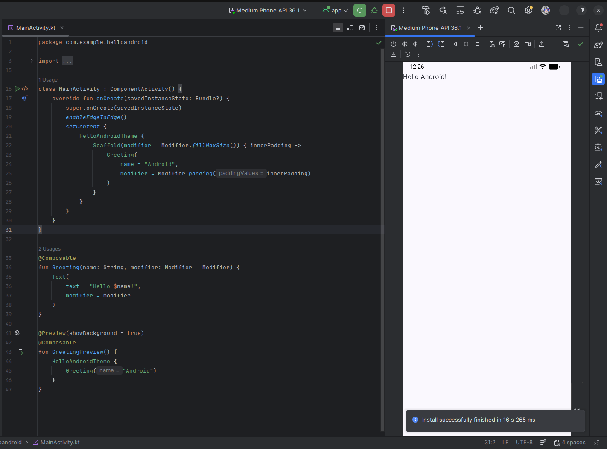</details> |
| Rojas Barrón Isaac | <details><summary>Ver captura</summary>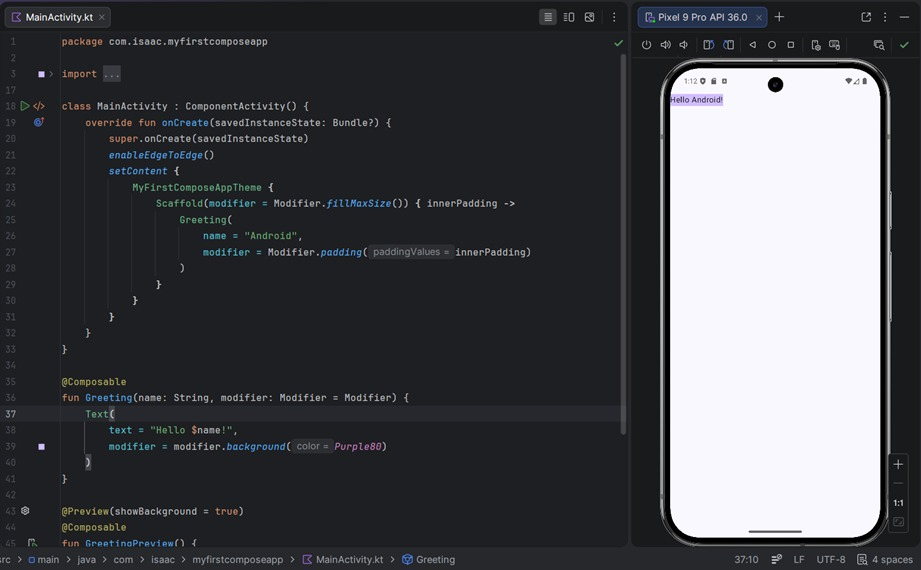</details> |

Evidencias - Configuración de Flutter

A continuación se presentan las evidencias solicitadas sobre la verificación del entorno de Flutter y la ejecución de una aplicación de prueba en el emulador.

Ejecución de `flutter doctor`

| Integrante | Evidencia |
|------------|------------|
| Ríos Gómez Juan Esteban | <details><summary>Ver captura</summary>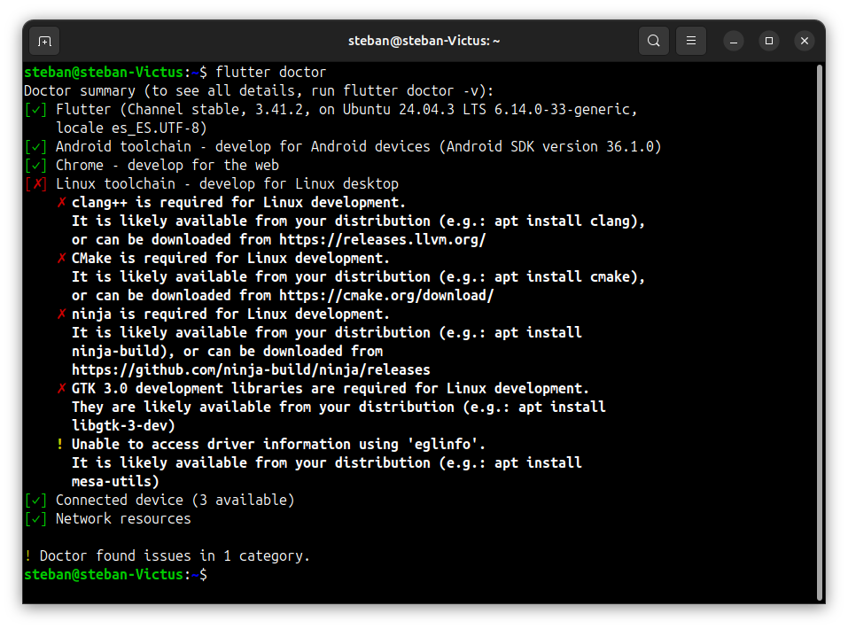</details> |
| Rojas Barrón Isaac | <details><summary>Ver captura</summary>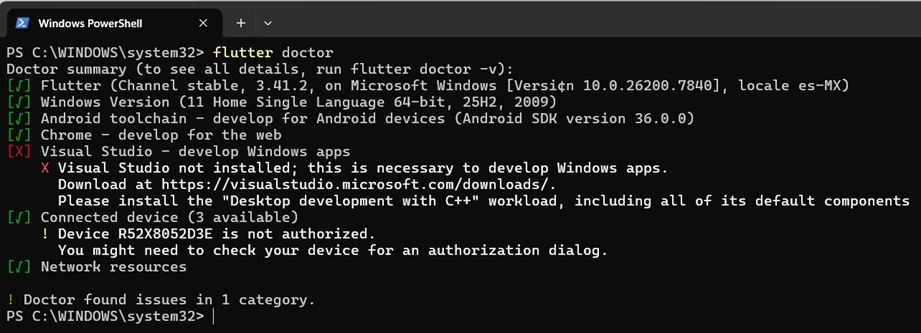</details> |

---
Creación y ejecución de `flutter create hello_flutter`

| Integrante | Evidencia |
|------------|------------|
| Ríos Gómez Juan Esteban | <details><summary>Ver captura</summary>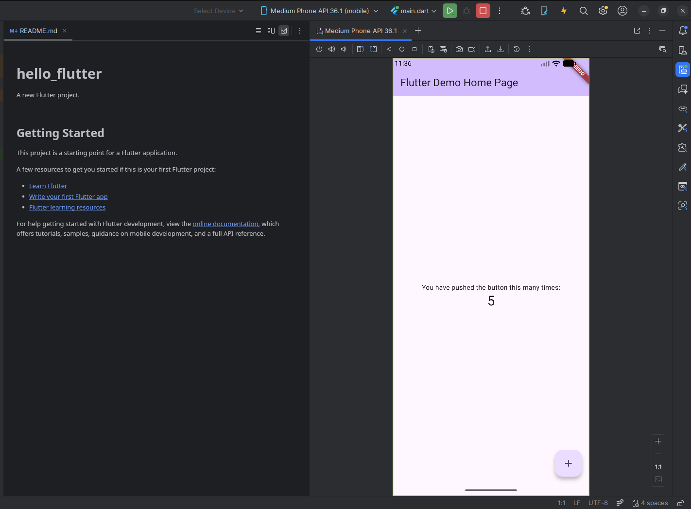</details> |
| Rojas Barrón Isaac | <details><summary>Ver captura</summary>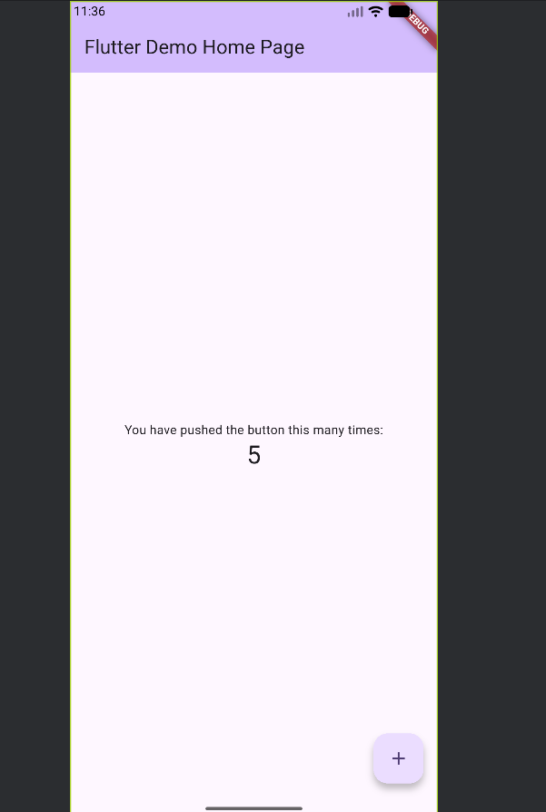</details> |


# 2- Navegación Creativa (Aplicación de Navegación por Activities)

Esta es una aplicación de ejemplo desarrollada en Android Studio que demuestra la navegación entre múltiples Activities. La aplicación guía al usuario a través de un viaje conceptual desde la Vía Láctea hasta un destino final ficticio llamado "Ecatepunk".

## 1. Descripción de las Activities

La aplicación consta de las siguientes Activities, cada una representando una pantalla con un tema específico:

1.  **`BienvenidaActivity`**
    - **Descripción:** Es la pantalla de inicio de la aplicación. Su función es dar la bienvenida al usuario y proporcionar un botón "Comenzar" para iniciar el recorrido por las demás pantallas.

2.  **`GalaxiaActivity`**
    - **Descripción:** Representa la inmensidad de una galaxia. Esta actividad contiene dos botones: "Siguiente", que lleva a la pantalla del Sistema Solar, y "Anterior", cuya funcionalidad no está implementada en el código proporcionado, pero se espera que regrese a la pantalla de Bienvenida.

3.  **`SistemaSolarActivity`**
    - **Descripción:** Muestra información o una representación del Sistema Solar. Permite la navegación hacia atrás (a `GalaxiaActivity`) mediante el método `finish()` y hacia adelante (a `PlanetasActivity`) con un `Intent`.

4.  **`PlanetasActivity`**
    - **Descripción:** Pantalla dedicada a los planetas. Similar a la anterior, permite regresar a `SistemaSolarActivity` con `finish()` y avanzar a `TierraActivity` con un `Intent`.

5.  **`TierraActivity`**
    - **Descripción:** Enfocada en el planeta Tierra. Ofrece navegación hacia atrás (a `PlanetasActivity`) con `finish()` y hacia adelante (a `PaisesActivity`) con un `Intent`.

6.  **`PaisesActivity`**
    - **Descripción:** Representa la pantalla de "Países". Desde aquí, el botón "Anterior" regresa a `TierraActivity` usando `finish()`. El botón "Siguiente" (etiquetado como `btnFinalizar` en el código) avanza a la última pantalla, `EcatepunkActivity`.

7.  **`EcatepunkActivity`**
    - **Descripción:** Es la pantalla final de la aplicación. Contiene un botón "Anterior" que regresa a `PaisesActivity` con `finish()` y un botón "Finalizar" que cierra completamente la aplicación usando `finishAffinity()`.

## 2. Manejo de Transiciones y Ciclo de Vida

### 1) Manejo de Transiciones entre Activities

La navegación entre pantallas se implementó mediante **Intents explícitos**, permitiendo cambiar de una `Activity` a otra dentro de la misma aplicación.

### Implementación

```kotlin
val intent = Intent(this, OtraActivity::class.java)
startActivity(intent)
```

### Funcionamiento

- `Intent` define la Activity destino.
- `startActivity()` inicia la nueva Activity.
- Android coloca la nueva Activity en el **Back Stack**.
- La Activity actual pasa a estado `onPause()` y posteriormente `onStop()` si deja de ser visible.

### Comportamiento del Back Stack

Android maneja una pila (LIFO):

```
Bienvenida
   ↓
SistemaSolar
   ↓
Planetas
   ↓
Tierra
```

Cuando el usuario presiona el botón **Back**:

1. Se ejecuta `onPause()`
2. Luego `onStop()`
3. Finalmente `onDestroy()` en la Activity actual
4. La Activity anterior pasa por `onRestart()` → `onStart()` → `onResume()`

Esto permite una navegación natural sin necesidad de administrar manualmente la pila.

---

### 2) Manejo del Ciclo de Vida de Android

Cada `Activity` sigue el ciclo de vida administrado por el sistema operativo Android.

En el proyecto se utilizó principalmente el método `onCreate()`:

```kotlin
override fun onCreate(savedInstanceState: Bundle?) {
    super.onCreate(savedInstanceState)
    setContentView(R.layout.activity_name)
}
```

### Flujo normal de ejecución

Al abrir una Activity:

```
onCreate()
onStart()
onResume()
```

Al cambiar a otra Activity:

```
Activity actual → onPause()
                 → onStop()

Nueva Activity  → onCreate()
                 → onStart()
                 → onResume()
```

---

### 3) Gestión Implícita del Ciclo de Vida

No fue necesario sobrescribir métodos como:

- `onPause()`
- `onStop()`
- `onRestart()`
- `onDestroy()`

Android gestiona automáticamente:

- La liberación temporal de recursos
- La restauración de la Activity anterior
- La destrucción cuando el sistema requiere memoria

Dado que la aplicación es informativa y no maneja datos dinámicos, no fue necesario un control avanzado del estado.

---

### 4) Manejo ante Rotación de Pantalla

En esta implementación:

- No se utilizó `onSaveInstanceState()`
- No se restauraron datos manualmente

Cuando ocurre una rotación:

- La Activity se destruye
- Se vuelve a ejecutar `onCreate()`
- Se reconstruye la interfaz

Como la aplicación muestra contenido estático, no se pierde información relevante.

---

### 5) Control de Finalización de Activities

En caso de utilizar:

```kotlin
finish()
```

Se elimina la Activity actual del Back Stack, evitando que el usuario pueda regresar a ella con el botón Back.

---

##  3. Instrucciones para Ejecutar la Aplicación

Sigue estos pasos para ejecutar la aplicación en un entorno de desarrollo:

### Prerrequisitos

-   **Android Studio:** Tener instalada la última versión estable de Android Studio (Iguana | 2023.2.1 o superior).
-   **JDK:** Java Development Kit (JDK) 17 o superior, generalmente incluido con Android Studio.
-   **Dispositivo/Emulador:** Un dispositivo Android físico con depuración USB habilitada o un Emulador de Android configurado (AVD).

### Pasos para la Ejecución

1.  **Clonar o Descargar el Proyecto:**
    - Si el código está en un repositorio, clónalo usando:
      ```bash
      git clone [URL del repositorio]
      ```
    - O descarga y descomprime el archivo ZIP del proyecto.

2.  **Abrir el Proyecto en Android Studio:**
    - Inicia Android Studio.
    - En la ventana de bienvenida, selecciona "Open".
    - Navega hasta la carpeta raíz del proyecto y haz clic en "OK".
    - Espera a que Android Studio importe y sincronice el proyecto (esto puede tomar unos minutos la primera vez).

3.  **Configurar un Dispositivo Virtual (Opcional pero Recomendado):**
    - Si no tienes un dispositivo físico, abre el "Device Manager" (Administrador de Dispositivos) desde la barra lateral derecha.
    - Haz clic en "Create device" y elige un modelo de teléfono (por ejemplo, Pixel 6).
    - Selecciona una imagen del sistema (recomendado: una versión reciente de API, como API 34) y descárgala si es necesario.
    - Finaliza la configuración.

4.  **Ejecutar la Aplicación:**
    - Conecta tu dispositivo físico vía USB (y asegúrate de tener la depuración USB activada) o asegúrate de que tu emulador esté encendido.
    - En la barra de herramientas de Android Studio, selecciona tu dispositivo/emulador en el menú desplegable.
    - Haz clic en el botón verde "Run" (icono de "play") o ve a `Run` -> `Run 'app'`.
    - Espera a que la aplicación se compile e instale en el dispositivo.

5.  **Interactuar con la App:**
    - Una vez instalada, la aplicación se abrirá automáticamente mostrando `BienvenidaActivity`. Presiona "Comenzar" y utiliza los botones "Siguiente" y "Anterior" para navegar a través de las pantallas. Finalmente, presiona "Finalizar" en la última pantalla para cerrar la app.

## 4. Capturas de pantalla del funcionamiento de la aplicación
| Pantalla | Vista |
|----------|--------|
| Menú principal | <details><summary>Ver</summary>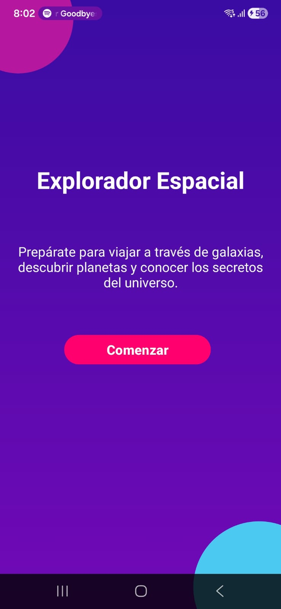</details> |
| Galaxia | <details><summary>Ver</summary>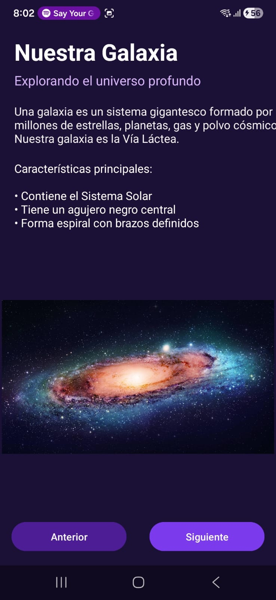</details> |
| Sistema Solar | <details><summary>Ver</summary>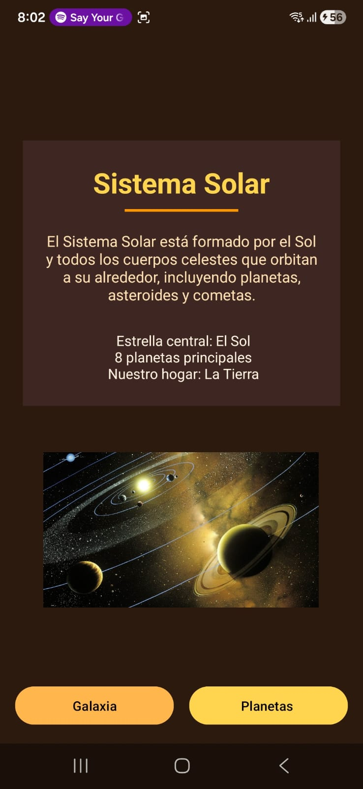</details> |
| Planetas | <details><summary>Ver</summary>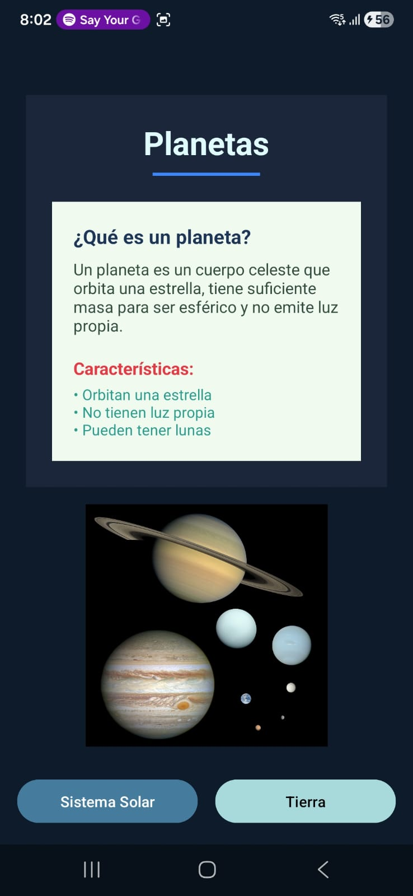</details> |
| Planeta Tierra | <details><summary>Ver</summary>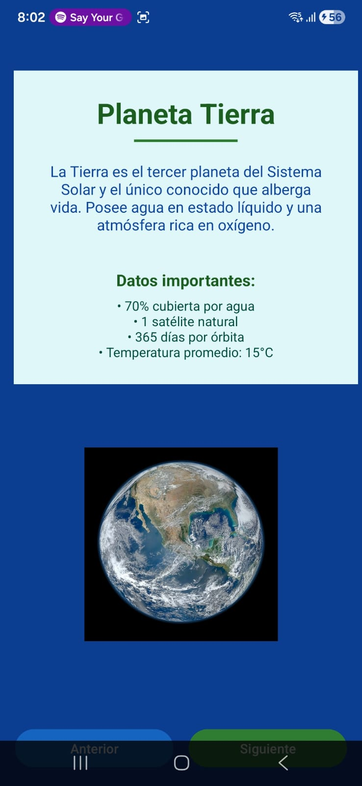</details> |
| Países | <details><summary>Ver</summary></details> |
| Ecatepunk | <details><summary>Ver</summary>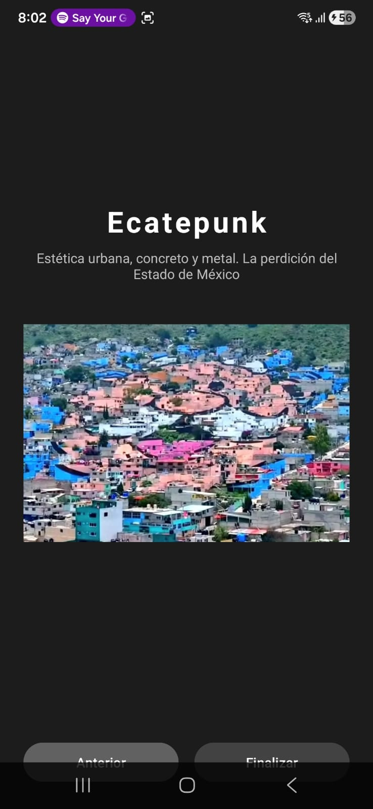</details> |

# 3- Comparación de equipos


- **PC 1:** HP Victus 15-fb1xxx  
  - Procesador: AMD Ryzen 5 7535HS  
  - RAM: 8 GB  
  - GPU: 4 GB  
  - Almacenamiento: 477 GB  

- **PC 2:** ASUS TUF Gaming F15 FX506HCB  
  - Procesador: Intel Core i5-11400H (11ª Gen)  
  - RAM: 24 GB  
  - GPU: 4 GB  
  - Almacenamiento: 477 GB  

---

### Resultado de la Comparación

| Posición | Equipo | Razón por la que ganó / quedó en esa posición | Imagen de referencia |
|----------|--------|----------------------------------------------|----------------------|
| 🥇 1 | ASUS TUF Gaming F15 (i5-11400H, 24GB RAM) | Tiene mayor cantidad de RAM (24GB vs 8GB), lo que mejora el rendimiento en multitarea, desarrollo, emuladores y programas pesados. | <details><summary>Ver</summary>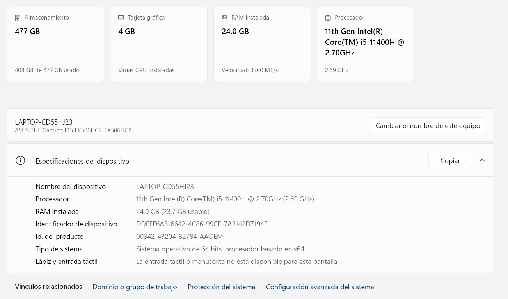</details> |
| 🥈 2 | HP Victus 15 (Ryzen 5 7535HS, 8GB RAM) | Buen procesador, pero la menor cantidad de RAM limita el rendimiento en tareas exigentes. | <details><summary>Ver</summary>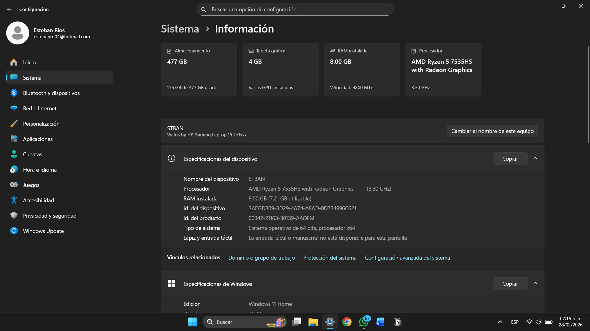</details>|

---
